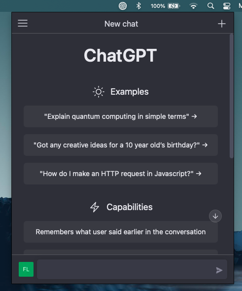
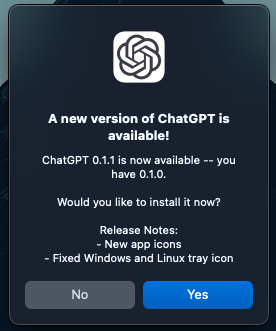

<p align="center">
  
</p>

# ChatGPT Desktop Application

Unofficial open source OpenAI ChatGPT desktop app for macOS, Windows, and Linux menubar using Tauri (<https://tauri.app/>) and Rust


[](https://github.com/flaviodelgrosso/chatgpt-desktop-app-tauri/releases)



## Global shortcuts

You can use Cmd+Shift+G (Mac) or Ctrl+Shift+G (Win) to quickly open it from anywhere.

## Updater

This application integrates the Tauri Updater, a tool built in Rust that allows for easy application updates. With the Tauri Updater, users can easily keep their application up to date with the latest bug fixes and features. The integration of the Tauri Updater ensures that users have a seamless update experience.



## Recommended IDE Setup

- [VS Code](https://code.visualstudio.com/) + [Tauri](https://marketplace.visualstudio.com/items?itemName=tauri-apps.tauri-vscode) + [rust-analyzer](https://marketplace.visualstudio.com/items?itemName=rust-lang.rust-analyzer)

## Developing

```bash
yarn
yarn dev
```

## Building

```bash
yarn
yarn build
```
